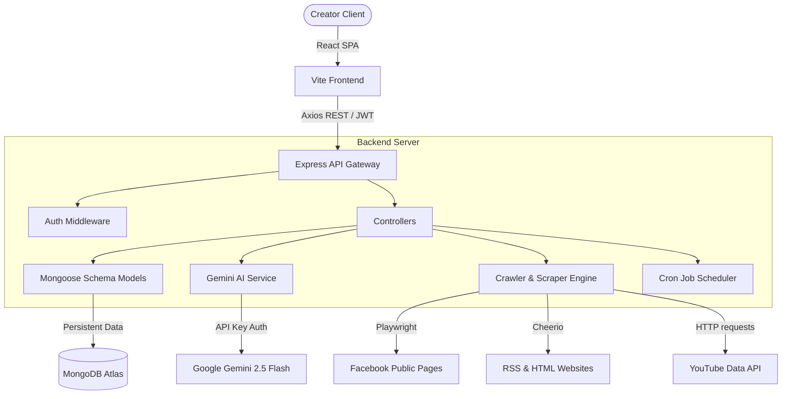
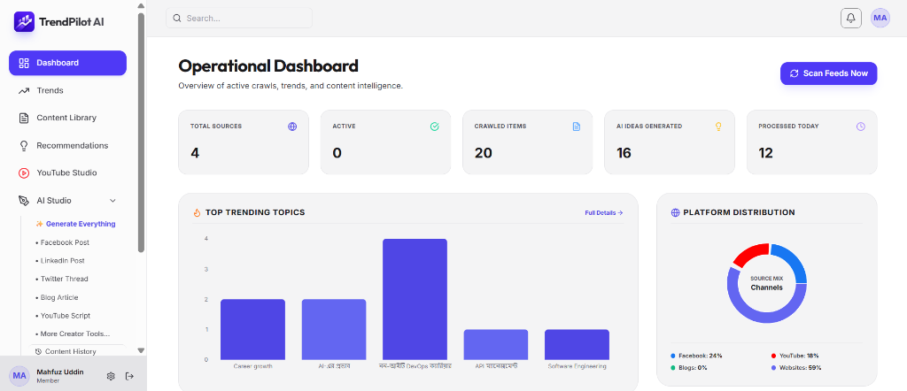
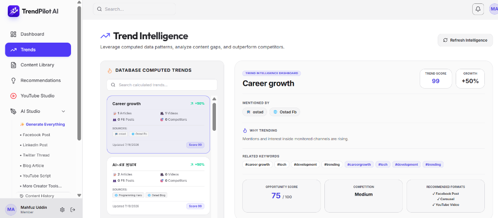
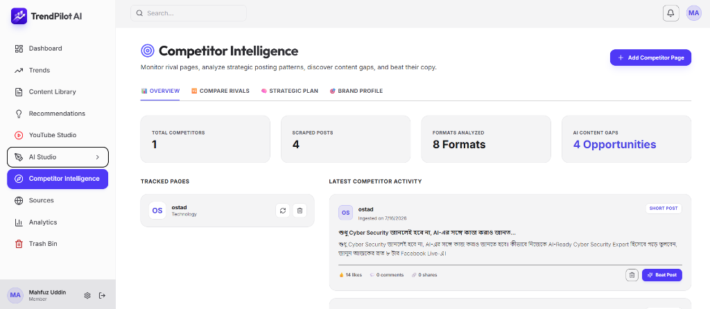
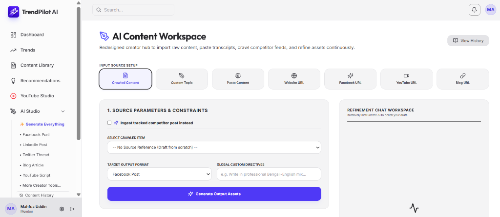
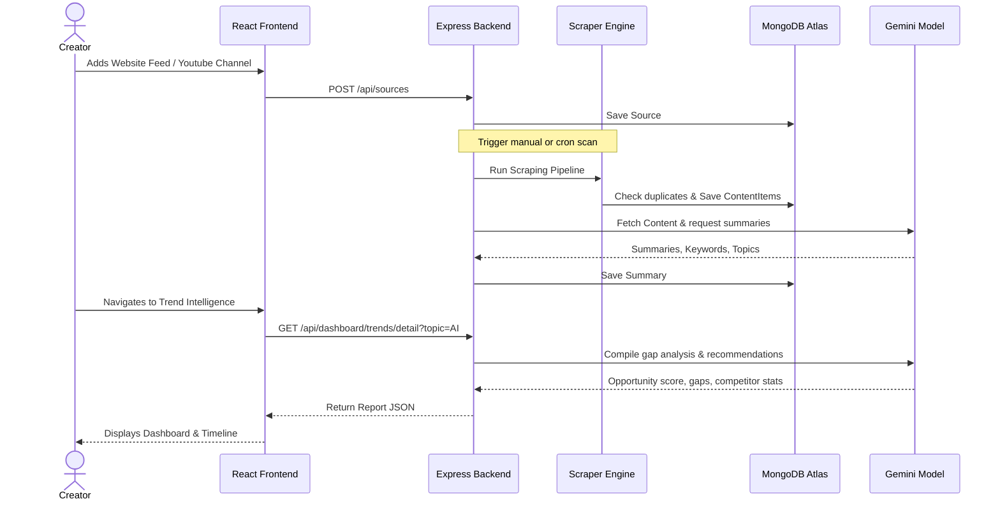

# TrendPilot AI 🚀

[](#)
[](#)
[](#)
[](#)
[](#)

An AI-powered, multi-tenant Content Intelligence and Social Growth Platform designed for creators, digital marketers, marketing agencies, and businesses. TrendPilot AI automates trend research, competitor monitoring, and content drafting by transforming raw web data into actionable, viral creative blueprints.

---

## 📖 Table of Contents

1. [Project Overview](#1-project-overview)
2. [Features](#2-features)
3. [Architecture](#3-architecture)
4. [Tech Stack](#4-tech-stack)
5. [Folder Structure](#5-folder-structure)
6. [Database Schema](#6-database-schema)
7. [API Documentation](#7-api-documentation)
8. [AI Modules & Refinement](#8-ai-modules--refinement)
9. [Crawlers](#9-crawlers)
10. [Scheduler](#10-scheduler)
11. [Installation](#11-installation)
12. [Environment Variables](#12-environment-variables)
13. [Deployment](#13-deployment)
14. [Screenshots](#14-screenshots)
15. [Workflow](#15-workflow)
16. [Future Roadmap](#16-future-roadmap)
17. [Contributors](#17-contributors)
18. [License](#18-license)
19. [Credits](#19-credits)
20. [Acknowledgements](#20-acknowledgements)

---

## 1. Project Overview

### The Problem
Modern creators and marketing teams spend hours manually scouring blogs, RSS feeds, YouTube channels, and competitor Facebook pages to identify what topics are trending, what their competitors are posting, and what angles are performing best. This manual research process is tedious, slows down publishing times, and lacks data-driven gap analysis.

### The Solution
**TrendPilot AI** solves this by providing a unified, multi-tenant SaaS workspace. It programmatically crawls websites (RSS and custom HTML), YouTube feeds, and public Facebook pages. The platform then uses Google Gemini models to:
- Automatically summarize articles and index key topics.
- Perform detailed **Content Gap Analyses** identifying what competitors missed.
- Draft tailored social media posts, email newsletters, scripts, and blog articles.
- Generate high-performance **Beat Competitor** battle blueprints to improve engagement.
- Store all generated assets in a **Persistent AI Content Workspace** supporting collaborative refinement, auto-saving, version histories, and chat history preservation.

---

## 2. Features

| Feature | Description |
| :--- | :--- |
| **Multi-User SaaS Isolation** | Authentic data isolation where every user's sources, content library, and AI drafts are private and protected by JWT. |
| **Multilingual AI Output** | Full support for generating natural Bangla (keeping technical terms in English) and fluent English based on user preferences. |
| **Website & RSS Ingestion** | Crawls raw web articles and indexes metadata using `cheerio` and XML parsers. |
| **YouTube Channel Scraper** | Tracks channel uploads and views using the YouTube Data API. |
| **Playwright Facebook Crawler** | Headless browser scraper that auto-scrolls, expands collapsed text ("See more", "Continue Reading"), bypasses login gates, and parses metrics. |
| **Trend Detail Panel** | Interactive dashboard showcasing growth reasons, opportunity scores, related keywords, and formats. |
| **Opportunity & Gap Analysis** | AI assessment detailing competitor strengths, explanation holes, and questions users are asking. |
| **Beat Competitor Strategist** | Direct competitive analysis comparison to draft superior hooks, thumbnails, and CTAs. |
| **Persistent Content Workspace** | ChatGPT-style document workspace where generations are saved automatically, and refinements edit the existing document instead of spawning random content. |
| **Auto-Save with Indication** | Keeps your content safe in real-time with a debounced 2-second auto-save and displays "Last Saved" timestamp badges. |
| **Version History Subsystem** | Compiles clean version checkpoints on every refinement (v1, v2, v3, etc.) allowing inline preview, restoration, and revision comparisons. |
| **Refinement Chat Persistence** | Stores the entire iterative conversation history linked to each document so you can resume editing exactly where you left off. |
| **AI Content History Page** | Search, filter, and paginated overview of all past workspace documents, supporting duplicates, soft-deletes (Trash Bin), favorites, and formatting exports. |
| **Universal Document Exporting** | Export your assets as Markdown, PDF, plain text (TXT), or copy instantly to your clipboard. |
| **Generate Everything CTA** | Instantly generates a package of 19 content assets (posts, newsletters, scripts, and SEO blogs). |
| **Background Cron Scheduler** | Periodic scanning runner checking active sources with exponential backoff on failures. |

---

## 3. Architecture

TrendPilot AI follows a decoupled MERN architecture with an AI core:



### Subsystems
- **Frontend SPA**: React 19 app with TailwindCSS styling, TanStack React Query cache management, and Recharts visualization.
- **Backend API Gateway**: Express.js server providing routing, schema validation, rate-limiting, and error fallback handlers.
- **Database**: MongoDB instance organizing user accounts, crawling schedules, content summaries, and generated studio outputs.
- **AI Core**: Gemini 2.5 Flash orchestrator tailoring summaries, post prompts, gap analyses, and multilingual translation structures.
- **Crawlers**: Scraper pipeline extracting metrics and text logs from social and web feeds.

---

## 4. Tech Stack

- **Frontend**:     
- **Backend**:    
- **AI/Crawlers**:   
- **Utilities**: `bcryptjs` (passwords), `jsonwebtoken` (auth tokens), `node-cron` (scheduling).

---

## 5. Folder Structure

```
TrendPilot-AI/
├── client/                     # Frontend Application
│   ├── src/
│   │   ├── components/         # Reusable UI Elements (Shadcn-like, Modals)
│   │   ├── context/            # Global React Context providers
│   │   ├── hooks/              # Custom hook abstractions
│   │   ├── layouts/            # Dashboard & Auth page layouts
│   │   ├── pages/              # SPA Pages (Trends, Library, AI Studio, History, etc.)
│   │   ├── services/           # Axios HTTP endpoints integrations
│   │   └── utils/              # Client-side formatting helpers
│   ├── public/                 # Static assets (Favicon, Logo banners)
│   └── index.html              # Frontend DOM entrypoint
├── server/                     # Backend API Server
│   ├── controllers/            # Request handlers (AI Studio, Workspace, Content, Trends)
│   ├── middleware/             # Express handlers (JWT validation, errors)
│   ├── models/                 # Mongoose Database Schemas
│   ├── routes/                 # REST Route specifications
│   ├── services/               # Gemini AI & Playwright scraping services
│   ├── tests/                  # Integration and verification test scripts
│   └── server.js               # Main server listener start script
```

---

## 6. Database Schema

All collections enforce database indices mapping `userId` and sorting parameters (`createdAt`, `status`, `sourceId`) for performance and tenant safety:

1. **User**: Credentials, active token keys, and preference configurations (`language` toggle).
2. **Source**: Monitored feeds (URL, category, platform type, status).
3. **ContentItem**: Ingested raw article metadata (title, URL, publishing date, processed status).
4. **Summary**: AI summary texts, keyword arrays, and extracted topics matching a `ContentItem`.
5. **Recommendation**: Targeted social platform prompts, hooks, and opportunity growth scores.
6. **Competitor**: Monitored competitor details (brand name, page URL, platform, category).
7. **CompetitorPost**: Crawled social posts, captions, publishing dates, media URLs, and reactions.
8. **WorkspaceDocument**: AI Content Workspace documents, version histories, chat conversation entries, tags, favorites, and soft delete fields.
9. **StudioOutput**: AI Studio outputs saved by users (legacy format types, instructions, content blocks).
10. **Job**: Scheduler logs (crawler queues, completion status, errors).

---

## 7. API Documentation

### Authentication Routes
| Method | URL | Auth | Description |
| :--- | :--- | :---: | :--- |
| `POST` | `/api/auth/register` | No | Creates a new user profile. |
| `POST` | `/api/auth/login` | No | Validates credentials and returns JWT token. |
| `GET` | `/api/auth/profile` | Yes | Retrieves authenticated user configuration details. |
| `PUT` | `/api/auth/profile/language` | Yes | Updates language preferences (`bn` or `en`). |

### Ingestion Source Routes
| Method | URL | Auth | Description |
| :--- | :--- | :---: | :--- |
| `GET` | `/api/sources` | Yes | Lists user's active ingestion sources. |
| `POST` | `/api/sources` | Yes | Adds a new RSS or YouTube source. |
| `DELETE` | `/api/sources/:id` | Yes | Deletes a source and checks tenant ownership. |
| `PATCH` | `/api/sources/:id/pause` | Yes | Pauses crawler schedules for the source. |
| `PATCH` | `/api/sources/:id/resume` | Yes | Resumes crawler schedules for the source. |

### Competitor Routes
| Method | URL | Auth | Description |
| :--- | :--- | :---: | :--- |
| `GET` | `/api/competitors` | Yes | Lists user's active competitor brands. |
| `POST` | `/api/competitors` | Yes | Creates a competitor page reference. |
| `DELETE` | `/api/competitors/:id` | Yes | Removes competitor profile from database. |

### Content & Recommendation Routes
| Method | URL | Auth | Description |
| :--- | :--- | :---: | :--- |
| `GET` | `/api/content` | Yes | Gets crawled items list with search and format queries. |
| `GET` | `/api/content/:id` | Yes | Gets detailed article text, summary, and topics. |
| `DELETE` | `/api/content/:id` | Yes | Deletes a content item and cascades related AI documents. |
| `GET` | `/api/recommendations` | Yes | Lists social content ideas. |
| `POST` | `/api/recommendations/:contentId/generate` | Yes | Computes social concept options for an article. |

### Trend Intelligence & AI Studio Routes
| Method | URL | Auth | Description |
| :--- | :--- | :---: | :--- |
| `GET` | `/api/dashboard/trends/topics` | Yes | Lists computed trending topics from summaries. |
| `GET` | `/api/dashboard/trends/detail` | Yes | Returns detailed gap analysis and timelines. |
| `POST` | `/api/dashboard/trends/generate-all` | Yes | Compiles the full 19-asset package for a trend. |
| `POST` | `/api/dashboard/trends/beat-competitor` | Yes | Generates strategy comparisons to defeat competitors. |
| `POST` | `/api/studio/generate` | Yes | Formats custom posts/scripts in the AI Studio editor. |
| `POST` | `/api/studio/refine` | Yes | Refines the active editor content based on user chat prompts. |

### Workspace & Document History Routes
| Method | URL | Auth | Description |
| :--- | :--- | :---: | :--- |
| `GET` | `/api/workspace` | Yes | Lists user's workspace documents (with search, filter, sorting, pagination). |
| `GET` | `/api/workspace/:id` | Yes | Retrieves full details of a document (including versions and chat history). |
| `PUT` | `/api/workspace/:id` | Yes | Saves document modifications (supports auto-save). |
| `PUT` | `/api/workspace/:id/favorite` | Yes | Toggles the favorite flag on a document. |
| `POST` | `/api/workspace/:id/duplicate` | Yes | Deep copies a document into a new Workspace entry. |
| `PUT` | `/api/workspace/:id/restore-version` | Yes | Restores the editor contents to a specific version number. |
| `DELETE` | `/api/workspace/:id` | Yes | Soft-deletes a document and moves it to the Trash bin. |
| `PUT` | `/api/workspace/:id/undelete` | Yes | Recovers a soft-deleted document back to the active workspace. |

---

## 8. AI Modules & Refinement

1. **AI Summary**: Parses long raw HTML or video logs, outputting key bullet summaries and metadata keywords.
2. **Trend Analysis**: Groups topics from summaries to compute growth charts, opportunity points, and recommended audiences.
3. **Content Gap Analysis**: Evaluates competitor posts against library content to determine unexplained topics and questions users are asking.
4. **Beat Competitor**: Generates superior post copies (better hooks, thumbnails, CTAs) compared to selected competitors.
5. **Generate Everything**: Large prompt generator compiling script copy, email sequences, carousels, threads, and SEO blogs.
6. **Refinement Editor**: A single-shot context-aware editor prompt instructing the AI model to *only* edit the existing text layout based on the user request, guaranteeing that the context, topic, and formatting structure is never replaced by unrelated drafts.

---

## 9. Crawlers

```
                +-------------------+
                |   Crawl Request   |
                +-------------------+
                          |
         +----------------+----------------+
         |                                 |
         v                                 v
+------------------+             +-------------------+
|  RSS / HTML Web  |             |  Social Pages     |
+------------------+             +-------------------+
| - xml-parser     |             | - Playwright      |
| - cheerio extraction           | - Auto-scroll     |
+------------------+             | - Expand text     |
         |                       +-------------------+
         |                                 |
         +----------------+----------------+
                          |
                          v
                +-------------------+
                | DB Duplicate Check|
                +-------------------+
                          | (if new)
                          v
                +-------------------+
                | MongoDB Storage   |
                +-------------------+
                          |
                          v
                +-------------------+
                | AI Summary & Rec  |
                +-------------------+
```

- **RSS Scraper**: Periodically parses RSS XML feeds, handles relative URL resolutions, and fetches full HTML contents.
- **YouTube Scraper**: Pulls public video logs, views, and channel metrics from channel uploads.
- **Facebook Playwright Crawler**: Headless Chromium browser script. Automates scrolling to load dynamic posts, finds and clicks `"See more"` / `"Continue Reading"` tags (ignoring translations), extracts engagement stats, cleans trailing buttons, and captures failing screenshot viewports to `/screenshots` for debugging.
- **Retry Mechanism**: Enforces exponential backoff retries (3 attempts, doubling delays starting at 5 seconds) to handle rate-limiting.

---

## 10. Scheduler

- **Background Cron Engine**: Executed by `node-cron` running background scan iterations every 3 hours (customizable in environment variables).
- **Manual Scan**: Immediate trigger route scanning active feeds for the specific authenticated tenant.
- **Tenant Context**: Runs crawler queues matching only active sources belonging to the user.

---

## 11. Installation

### Prerequisites
- Node.js (v20.x or higher)
- MongoDB Atlas account (or local MongoDB database instance)
- Google Gemini API Key
- YouTube Data API Key (optional for YT ingestion)

### Setup Steps
1. **Clone project**:
   ```bash
   git clone https://github.com/your-username/TrendPilot-AI.git
   cd TrendPilot-AI
   ```

2. **Install all workspace dependencies**:
   ```bash
   npm run install:all
   ```

3. **Configure Environment Variables**:
   Create a `.env` file inside the `server/` directory based on the `.env.example` variables description.

4. **Install Playwright Browsers**:
   ```bash
   npx playwright install chromium
   ```

5. **Start Dev servers (concurrently)**:
   ```bash
   npm run dev
   ```

---

## 12. Environment Variables

Create `server/.env` with the following variables:

```ini
# Server Configuration
PORT=5001
NODE_ENV=development

# Database Uri
MONGO_URI=mongodb+srv://<user>:<password>@cluster.mongodb.net/trendpilot?retryWrites=true&w=majority

# JWT Token Secret
JWT_SECRET=your_jwt_secret_key_here

# AI Model Keys
GEMINI_API_KEY=AIzaSy...

# Crawler Keys
YOUTUBE_API_KEY=AIzaSy...
```

---

## 13. Deployment

### Frontend (Vercel)
Deploy `client/` folder as a React Single Page Application.
Configure rewrites for routes inside `client/vercel.json`:
```json
{
  "rewrites": [{ "source": "/(.*)", "destination": "/index.html" }]
}
```

### Backend (Render / Heroku)
Deploy `server/` folder as a Node.js web service.
Configure:
- **Build Command**: `npm install && npx playwright install chromium` (needed for headless scraping).
- **Start Command**: `npm start`.

### Environment configurations
Ensure `CORS_ORIGIN` is configured in production variables to match the frontend Vercel URL.

---

## 14. Screenshots

*Placeholders for user-interface mockups:*

| Dashboard Overview | Trend Intelligence Panel |
|:---:|:---:|
|  |  |

| Competitor Comparison | AI Studio Editor |
|:---:|:---:|
|  |  |

---

## 15. Workflow

The operational sequence for users:



---

## 16. Future Roadmap

- [ ] **Instagram Scraper**: Headless Playwright modules tracking public reels and accounts.
- [ ] **X (Twitter) Monitoring**: Ingestion service tracking viral text threads and spaces.
- [ ] **TikTok Growth Engine**: Metric scraping tracking trends and audio.
- [ ] **Midjourney Image Generator**: Inline visual asset generator inside AI Studio.
- [ ] **Content Calendar**: Drag-and-drop posting schedule calendar.
- [ ] **Team Workspaces**: Multiple contributors support inside isolated tenant accounts.

---

## 17. Contributors

- **Mahfuz** - Project Lead & Developer
- *Placeholders for open-source contributors*

---

## 18. License

Distributed under the **MIT License**. See `LICENSE` for more information.

---

## 19. Credits

- **Playwright** - Headless Browser Automation
- **TailwindCSS** - Style layout Framework
- **Recharts** - Interactive charts
- **Zustand** - Global state management
- **Axios** - Network communication client
- **Cheerio** - HTML parsing engine

---

## 20. Acknowledgements

- Google Gemini Team for the generative text infrastructure.
- MongoDB Atlas Cloud for the scaling document store.
- Vercel and Render for hosting ecosystems.